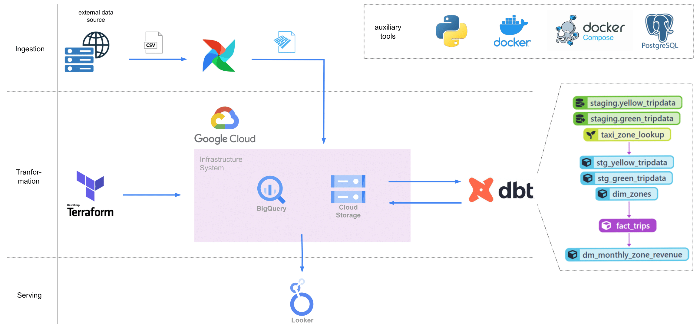
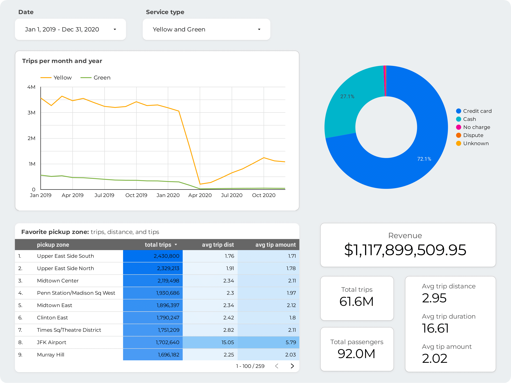

# GCP data engineering: NYC taxi rides

The goal of this project is to design and implement a data pipeline using modern data engineering tools and technologies to ingest, transform, and serve taxi trip data from 
the New York City [government website](https://www.nyc.gov/site/tlc/about/tlc-trip-record-data.page#).

### Project overview



The project can be divided into three main stages: **Ingestion**, **Transformation**, and **Serving**.

1. **Ingestion**: leveraging Airflow, we monthly download the Yellow and Green taxi trip data from the NYC government 
  website and ingest it into both the Google BigQuery and the bucket storage that we prepared using Terraform.

2. **Transformation**: we utilize DBT (Data Build Tool) to transform the data and create a `fact_trips` by combining the 
  Green and Yellow taxi data stored in BigQuery. We also create an additional table `dm_monthly_zone_revenue` - these 
  tables provide a unified view of the taxi trip data, which can be easily queried and analyzed.

3. **Serving**: finally, we employ Looker to build a visually appealing and interactive dashboard using the 
  transformed data from the BigQuery `fact_trips`.



### Technology stack

- Terraform: Infrastructure as Code tool used for interacting with Google cloud
- Airflow: workflow management platform for orchestrating the data ingestion process
- Google Cloud Storage (bucket): data lake used for storing raw data
- BigQuery (BQ): data warehouse used for storing and querying datasets
- DBT (Data Build Tool): data transformation tool for building a unified `fact_trips` from the Green and Yellow taxi data
- Looker: BI tool used to create interactive dashboard

### Setup and usage

You can use this project on your VM or run it locally. To set up the project locally, please follow these steps:

1. Clone the repository
2. Set up the necessary credentials for Google Cloud Platform (GCP) access: create Google Cloud project, 
   authorize APIs and billing, set preferred cloud location
3. Create a service account for Terraform, in the IAM section get `bigquery.admin` and `storage.admin` roles. 
   In the `terraform/variables.tf` write your Google project ID and region. Use `terraform init`, `terraform plan`, and
   `terraform apply` commands to create an infrastructure. Use `terraform destroy` if you want to destroy all 
   that cloud infrastructure.
4. Setup Airflow: in the `airflow/.env` file write your Google project ID and bucket name. Run `id -u` command 
   to know what is your AIRFLOW_UID write the result into the `airflow/.env` file. Ensure you have all needed for
   the Airflow dependencies such as Docker and Docker-compose. Run following commands:
   ```bash
   docker-compose build
   docker-compose up airflow-init  # initialize configs
   docker-compose up -d  # run Airflow
   docker-compose down  # ones you are finished
   ```
   You may now access the Airflow GUI by browsing to `localhost:8080`. Username and password are both *airflow*
5. To set up DBT, go to the dbt cloud, connect your Google project and cloned files from the `dbt`
   folder. In the `dbt/models/staging/schema.yml` write your Google project ID. Run `dbt build`
   to execute pipeline.
6. Use [Google Looker](https://lookerstudio.google.com/) to create the dashboard based on the BigQuery `fact_table`

### Future improvements

Here are some potential improvements for this project:
- Implement automated tests for the data pipeline to ensure the reliability and correctness of the data
- Integrate monitoring and alerting mechanisms to proactively identify and address any pipeline issues or data anomalies
- Create scripts to simplify GCP setup, and possibly run dbt from Airflow dag